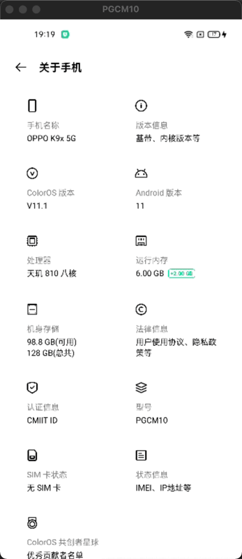
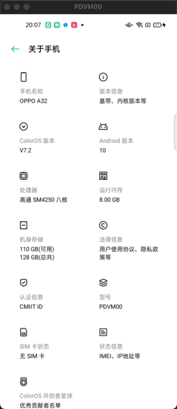

# 安卓保活KeepAliveCore 
1. 2022年5月最强Android安卓保活(地表最强保活)  
2. 无需任何权限、任何白名单  
3. 用户完全无感知(通知仅为演示，可以隐藏)  
4. 开机自启、安装自启、后台拉活  
5. 进程守护、永生不死、死后拉活  
6. 支持Android8、9、10、11、12【全版本覆盖】  
7. 支持华为、荣耀、小米、oppo、vivo、魅族、三星、中兴、联想、谷歌【全品牌覆盖】
8. 技术原理从Linux、Framework、Native层的角度去实现，非一像素、后台音乐、省电策略、白名单等弱鸡手段  
9. 另有免权限应用外弹窗方案等一系列黑科技方案
10. 支持的版本如下图所示

保活SDK|品牌|Android版本|ROM版本
---|---|---|---
KeepAliveCore|华为、荣耀|ALL|ALL(支持最新的鸿蒙2.0)
KeepAliveCore|小米|ALL|ALL(支持最新MIUI13)
KeepAliveCore|OPPO|ALL|ALL(支持最新ColorOs12)
KeepAliveCore|VIVO|ALL|ALL(支持最新OriginOs_Ocean)
KeepAliveCore|其他|ALL|ALL(支持最新Android13)
  
|👇🏻合作加微信👇🏻😡白嫖请绕行😡|👇🏻合作加微信👇🏻😡白嫖请绕行😡|👇🏻合作加微信👇🏻😡白嫖请绕行😡|
|:--:|:--:|:--:|
||||  
|👆🏻合作加微信👆🏻😡白嫖请绕行😡|👆🏻合作加微信👆🏻😡白嫖请绕行😡|👆🏻合作加微信👆🏻😡白嫖请绕行😡|

|华为_HarmonyOS_2.0.0.210|华为_HarmonyOS_2.0.0.213|荣耀_HarmonyOS_2.0.0|
|:--:|:--:|:--:|
|||
|小米_MIUI13_Android12|小米_MIUI12.5_Android11Dev|小米_MIUI12.5_Android11|
||||
|OPPO_ColorOS12_Android12|OPPO_ColorOS11.1_Android11|OPPO_ColorOS_7.2_Android10|
||||
|VIVO_OriginOS1.0_Android11|VIVO_OriginOS1.0_Android10|VIVO_OriginOS_Ocean_Android10|
||||
